# Weather analysis
Are you worried about climate change? Do you want to see the climate of your city compared to other cities in the world?

I will analyze a dataset of 3 tables with daily weather data from weather stations from all over the world since the 19th century.

## First inspection

We have 3 tables. The main one, daily_weather, contains daily measures from all the stations.
Taking a first glance at this first table, we can see the info that contains: station_id, city_name, date, and mostly info from temperature, precipitation and wind.

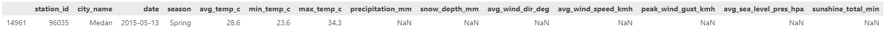

The other 2 tables give us info about the cities and the countries.

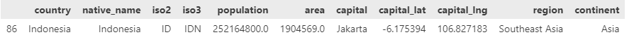

## Hypothesis
Considering the data we have, we could analyze the following:
- Temperature increasing, does it vary depending on the latitude or region?
- Compare the rainfall between cities, considering the total amount and the number of rainy days.
- Biggest differences between min and max temperatures
- Cities with the most stable average temperature throughout the year.
- Compare the sunshine

## General cleaning
Before importing the data into MySQL it's better to do a general cleaning.

First, I reset the index of the main dataframe (dfdailyweather).

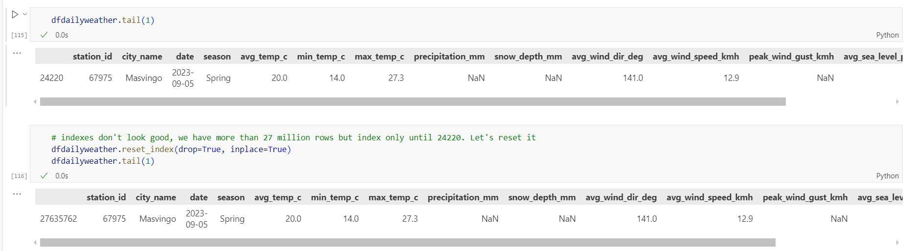

I could do a sample of for instance 1 million rows, but if I want to analyze data of a specific city I want to have all the results of that particular city.

It's a shame, because there are many queries that I find easier and faster with SQL, but I cannot do them on the full dataframe of 27 million rows, only with subsets that I first mask in Pandas, then export to csv, and then dump into MySQL. So I will do some queries in Pandas, when I have to look at the full dataset.

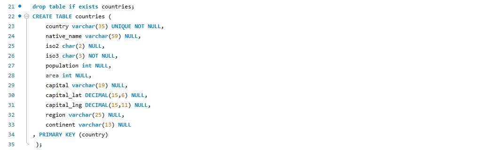

So first I create the tables in MySQL and define the primary and foreign keys, but when I try to import the dataframes from Pandas an error pops up. So I just import by now these 2 df without defyning the primary and foreign keys so I can write queries in MySQL to find out the problem.

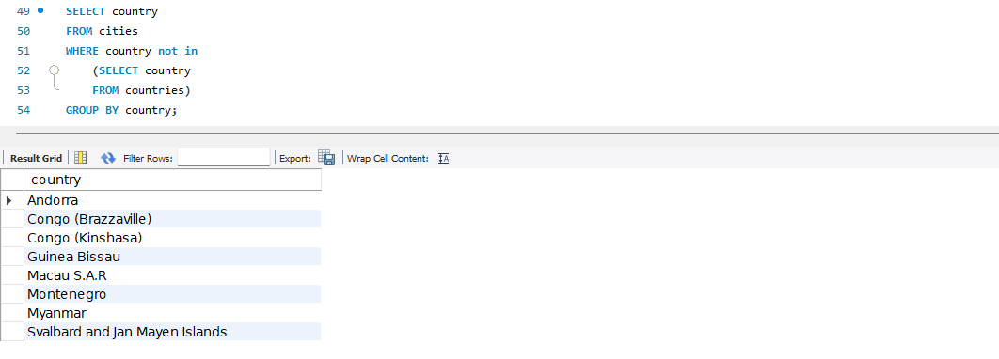

After some research I find that not all the cities in dfcities have a country registered in df countries. Some of these values only have the names changed, so I unify them (such as the USA), but some other countries don't appear in dfcountries, like Andorra and Montenegro, so I simply delete these cities from dfcities.

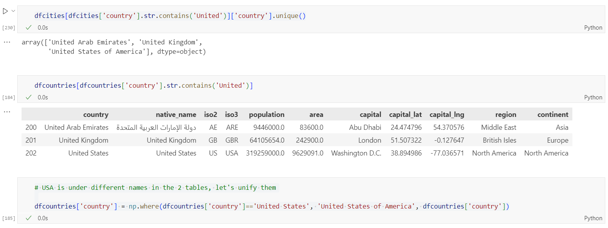

With these changes I can finally import these 2 dataframes into MySQL to write queries.

Since we have info of the date but not the year, I consider it's important creating this column. So I transform the type of *'date'* into a string so I can apply regex and I can extract the year from *'date'*.

I also found that '*station_id*' is not unique, meaning there are some cities with the same *'station_id'*, such as Port-au-Prince (Haiti) and Barahona (Dominican Republic), 130km away from each other.

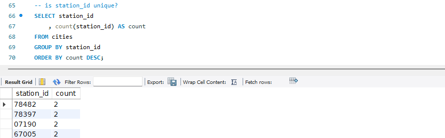

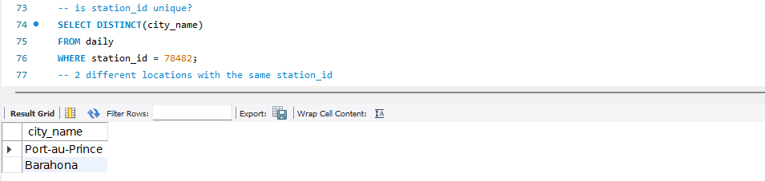

So I create a new column name **'station_name'**, with concatenates the *station_id* and the *city_name*, which will give me a unique value for each city.

**Years**: to know from which years I have data, I first sort the values and see that the first values are from 1750.

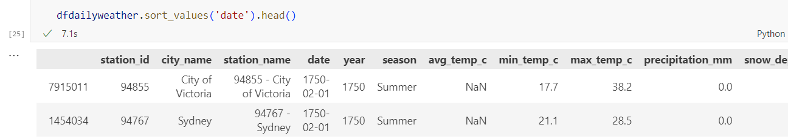

I generate some histograms (thanks to the created 'year' column) so I can see visually when most of the data is from.

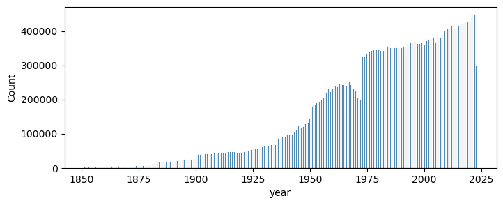

I continue until I get to the conclusion that most of the data is from 1973 until 2022, since we don't have data of the whole year of 2023.

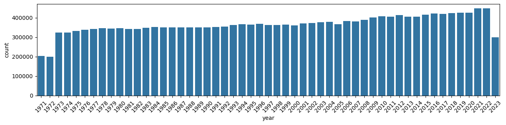

## Generating a sample of 1 million rows
If I want to work with the whole world I have 2 options: either work with a sample of say 1 million rows, so it's much faster and I can write queries in SQL, or I write the queries in Pandas and then extract a lot of heavy csv into Power BI, which doesn't make any sense.

So I create a sample of 1 million rows filtering by the years, between 1973 and 2022, exactly 50 years. I will just work with masks if I work with specific countries.

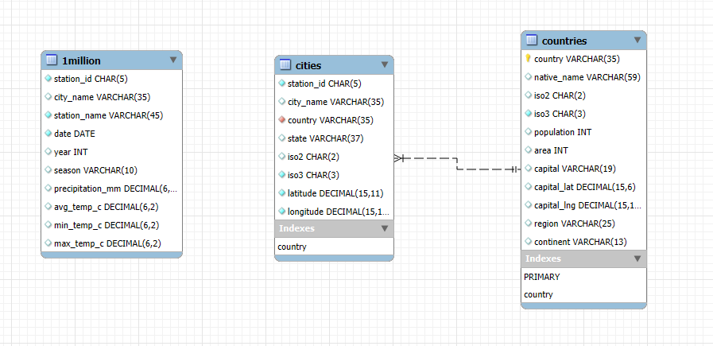

# Rain analysis - Bcn vs London

I want to study the relationship between the rainy days and the accumulated rain, because it's not the same a city where it usually rains, but with few quantity, than another city where it doesn't rain that often but when it does, it rains cats and dogs.

## Cleaning

I start comparing Barcelona, my city, with some city where it usually rains, such as London.

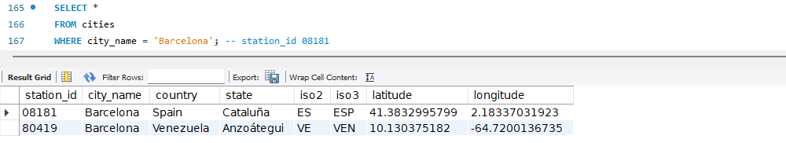

Here I find 2 cities named Barcelona, the one I want (in Spain) and one in Venezuela, and only one London, so I create a subset of these 2 cities to import it to Power BI and write queries in SQL.

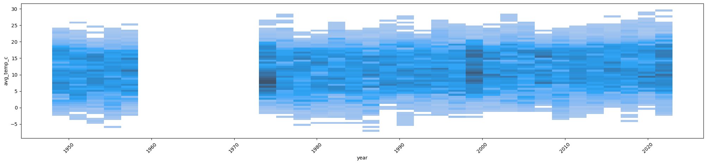

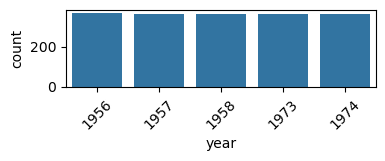

As we can see in the images above, London has no data from 1959 until 1972. 
Barcelona also has no data of avg_temp until 1973, so I create the subset from 1973 until 2022.

Now I can export it to .csv and sql to write queries in MySQL, more comfortably than in Pandas.

I first look into the extreme values to see if they make sense, and I find some really rainy days, so I check online if I can find some info about these episodes. 

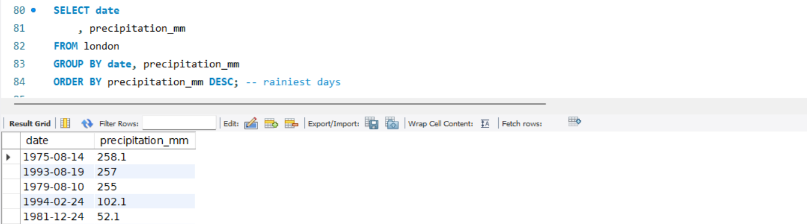

From some I can, but some I can't, so I replace these values in the original df with Pandas.

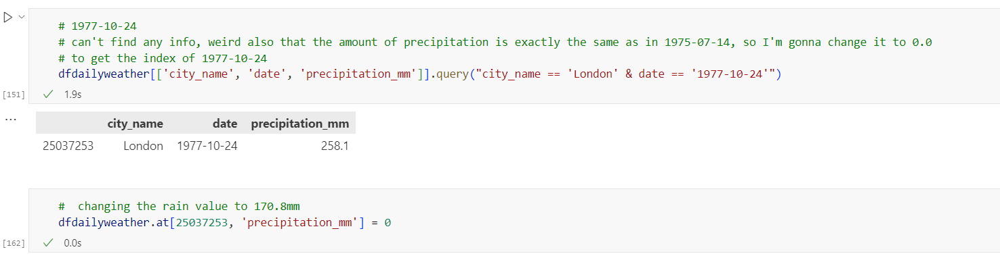

With the extreme rain values changed, I export again the .csv and import it to MySQL and Power BI. 

In Power BI I compare the accumulated rainfall and the number of rainy days (where precipitation_mm > 0), and surprisingly, Barcelona receives as much rain as London, contrary to what many people would think, but it has indeed less rainy days, meaning when it rains, it does with more intensity.
I can easily get the values from MySQL as well with a Union. 

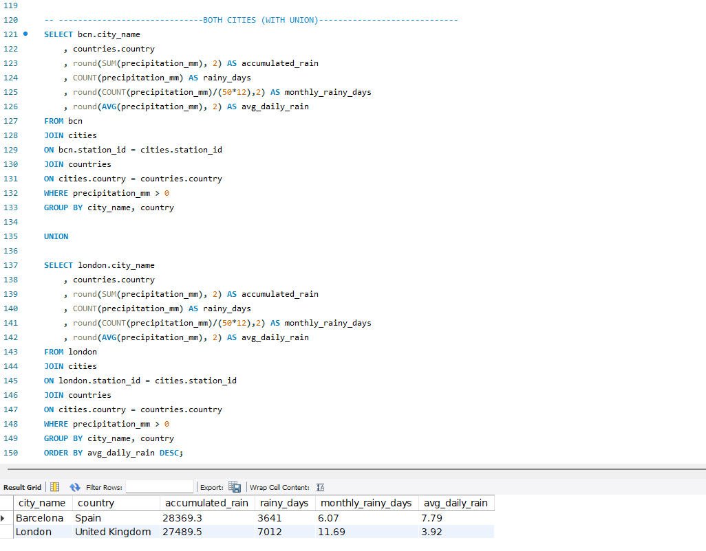

That way I check that I'm doing correctly the measures in Power BI.

In this case I'm not diving by 50 years but by a variable, because I applied a *year* filter.

# Analysis per Spain autonomous communities

I want to compare all cities I have from Spain (19), since it's the country I am from and know more. 

I found a .json map of Spain, but not including the Canary islands, so I will not include them.

Remember from Barcelona we only had data of avg_temp_c from 1973, and I want to work with the same range of years in the two sheets comparing temperature and rainfall, so that's going to be a constraint on the lower range of the years.

I want to work with all the available data, so I export it to MySQL and with a simple query I can see that I don't have data from all the cities from 1973. 

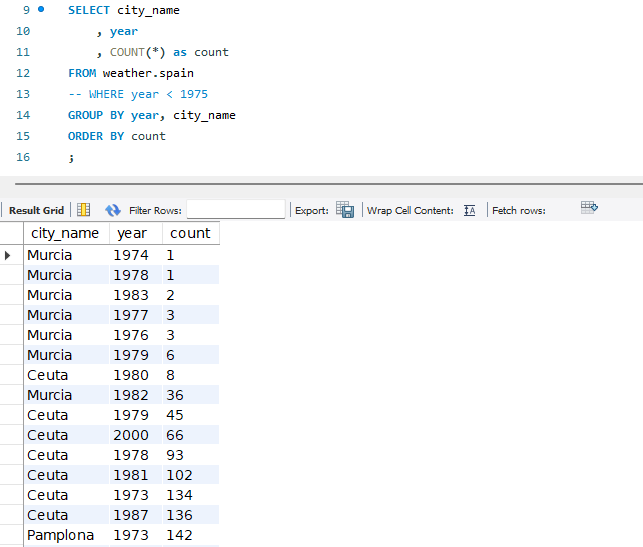

Actually here is better to export a .csv file and load it into Power BI, where with a simple linechart (with date and precipitation_mm) I can clearly visually see (the dark blue line) that from 1985 there's only one city that I don't have much data from: Ceuta. 

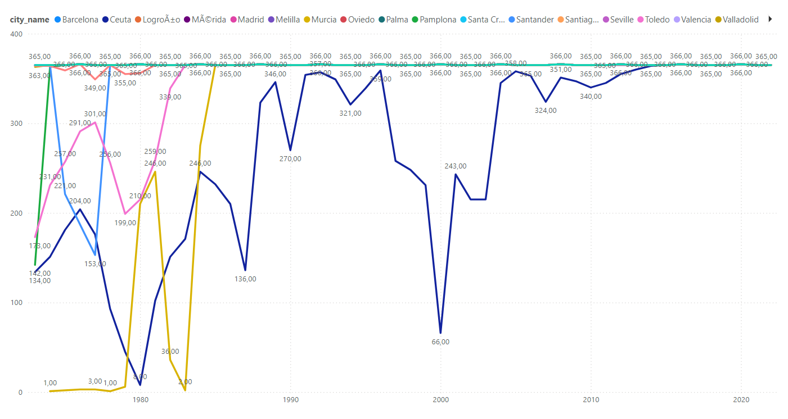

In this case I am lucky because it's not really important, it's a place so small that we could not see it in the map, so I can just exclude it. I will also exclude Melilla.

I also find that Valencia and Madrid only have data of avg_temp since 2017, so I'm just gonna have to deal with it. It's not as important as the rainfall, because it's an average, but it just won't appear in the map if someone filters out years from 2017.

## Rain
I want to display the rain visually in a map and a scatterplot comparing again the rainy days and the accumulated rain.

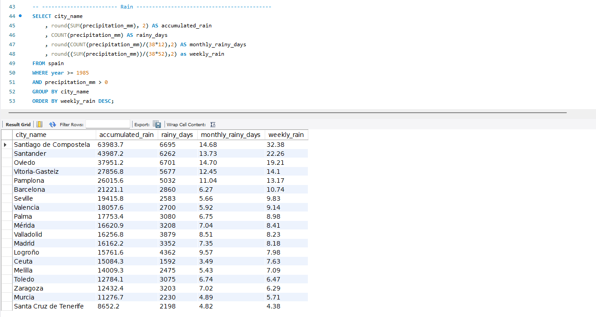

I check all the time with MySQL that I'm doing correctly the measures in Power BI.

In the scatterplot we can easily see that for instance Logroño is a city where it rains quite often, but not with a great amount of rain. 

I add a filter of season, and if we select 'Summer', I see that for instance Barcelona receives quite a lot of rain, in not many days. This is because of the afternoon showers when the temperature is really hot. 

## Temperature
Since Spain is not a tropical country, I imagine that the accumulated rain and the average temperature are inversely related, so where it rains the most (North of Spain) will be the coldest area of the country, and viceversa.

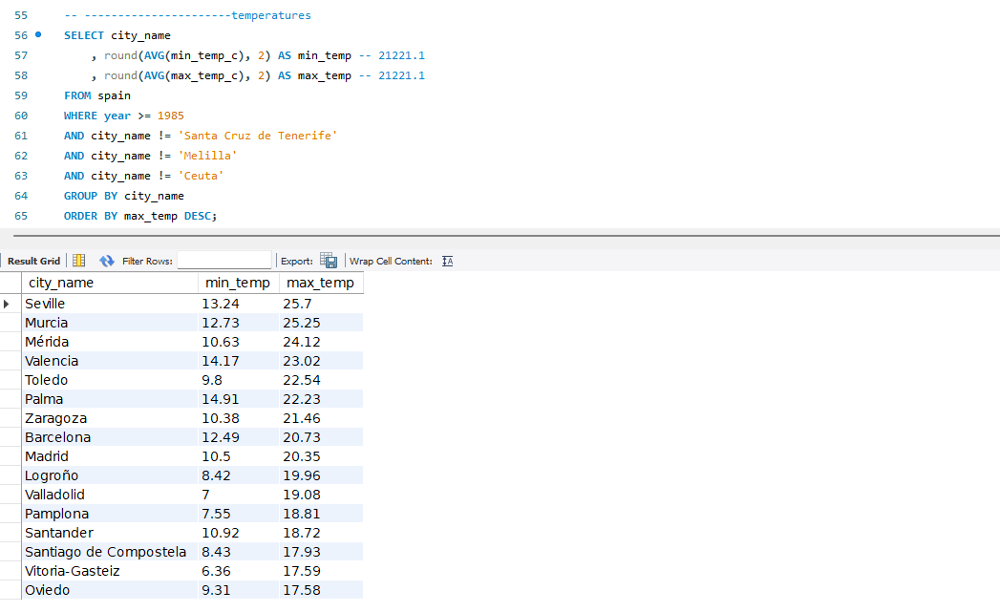

Here I display the same information: 
- A map, where I corroborate what I thought (the warmest cities are in the south of the country)
- A scatterplot with the averages of the minimum and maximum temperatures. Here we can observe that Palma doesn't have lot of range, the winter is not that cold.

If we filter by season, we can see that the coldest city is not where it rains the most, like Galicia, Asturias or Cantabria, but more towards towards the center of Spain, with cities like Valladolid, where it's really hot in summer and really cold in the winter, but also Toledo and Madrid.

## 4 Spanish cities

I find interesting to analyze 4 specific cities with more detail, so I select Barcelona, Santiago de Compostela (the rainiest and one of the coldest) and two others with values distinct enough so that when I create a linechart, the lines don't overlap: Logroño and Seville (the hottest).

In the linechart I want to study the temperature increase over the last 50 years (1973-2022), and to get the value I calculate it with the average of the first and last 7 years of this range, because one year would not be representative. The average temperature can vary from year to year, but there is a clear tendency. 

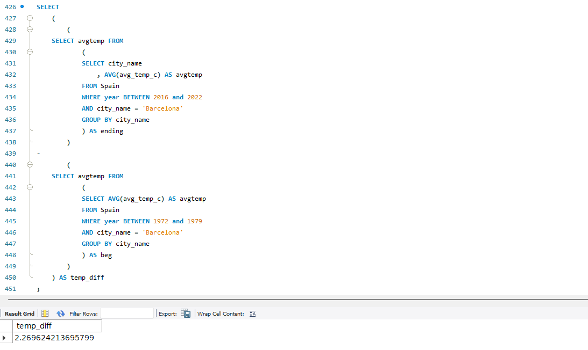

## Sunshine analysis

I don't think it makes sense to study it, since there are many cities with null values, such as Barcelona.

# World analysis per coordinates

Here I will work with a sample of 1 million rows with SQL and Power BI.

Is there any relation between the latitude and longitude and the temperature or rainfall?

## Cleaning

First of all, I take a quick look at the values and I notice that there are some nulls in the continent column.

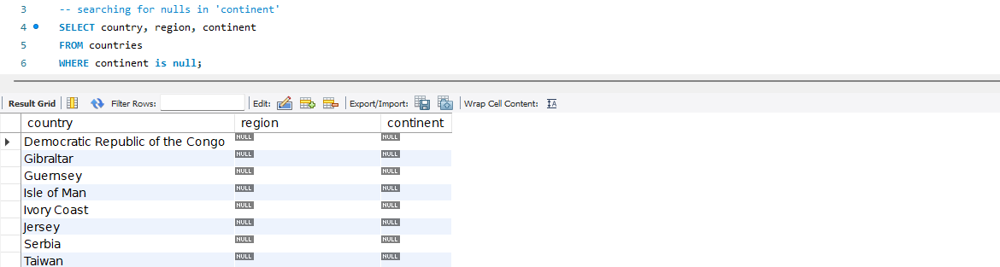

I will change these values in MySQL to practice, but it would only affect the sample, so I will change them as well in Pandas with the full dataframe of 27 million rows.

There are other countries that are in wrong continents, such as Zambia in Europe or Morocco in North America.

In order to look faster for these wrong values, I create a scatterplot of the world map with the longitude and latitude, with which I can see visually that some countries appear in different places, like Grenada, Anguilla and Dominica. 

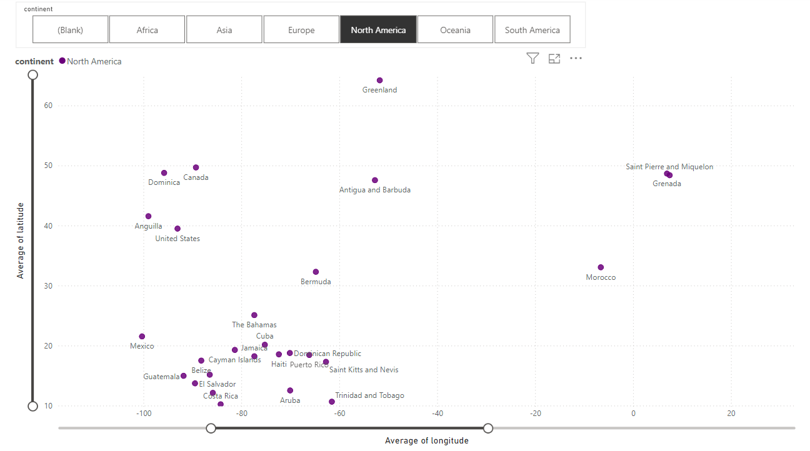

It turns out that the coordinates of these places are from places with the same name in other countries, so I have to manually change them.

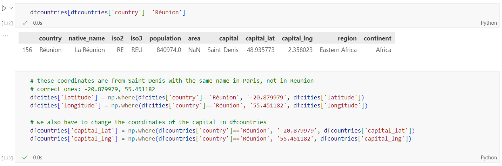

## Latitude and temperature

The lower the latitude, the closer the country is to the Equator, thus it receives the solar light more directly and therefore it is usually warmer, and the higher the latitude, the closer the country is to the poles, thus the colder it is. Let's check it visually.

Some values look odd, the second coldest place of Earth is Liechtenstein, only after Svalbard. Really? I mean it could be cold, because it's in the middle of the Alps, but it looks odd, so I prefer to exclude it. 

Some other countries are odd as well: Caribbean countries such as Dominica, Antigua and Barbuda, Anguilla, Montserrat and Grenada, with averages much lower than what we would expect.

I do some research in SQL and on internet and it doesn't make sense. So I will exclude these countries from this graphic.

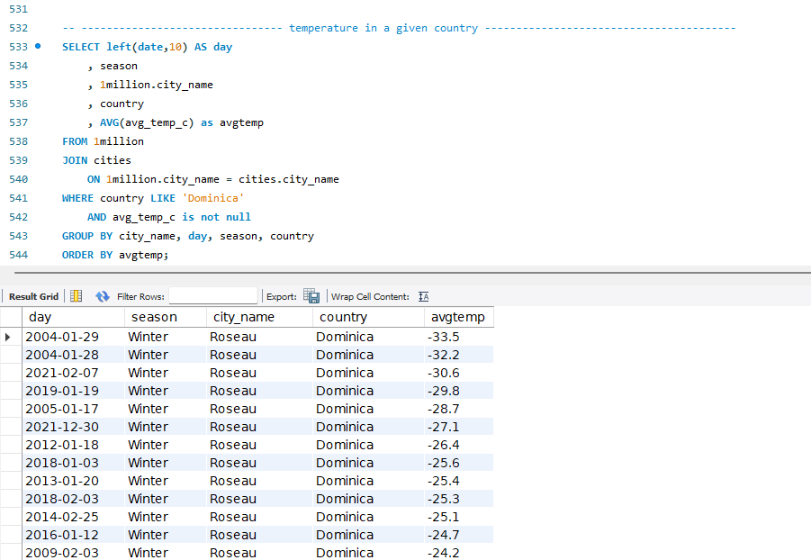 

## Longitude and rain

What about the longitude? We can see visually from West to East the rainiest places on Earth. 

If we filter by precipitation_mm > 0, some of the rainiest places of Earth are Saudi Arabia, Yemen or Bahrain.

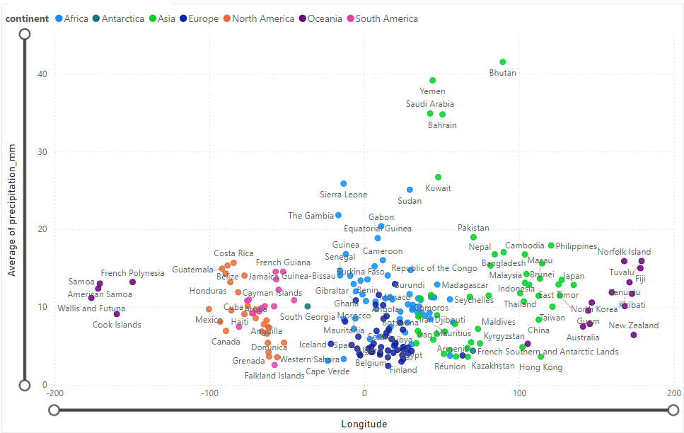 

Of course Yemen has an average so high, if it rained only 7 days and one of them had 257mm, which I investigated and couldn't find any info.

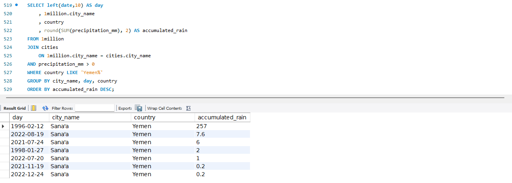 

So I cannot exclude the days where precipitation_mm = 0, because they contribute to the mean, which I'm displaying in the scatterplot. 

I don't worry too much about the extreme high values of rainfall, because I can just exclude these values with a filter in Power BI.

## Snow analysis
With Pandas I apply some filters and sort the values by the maximum average of snow_depth_mm, but I find some strange results such as cities with very few rainy days and cities in not so cold countries, such as Italy.

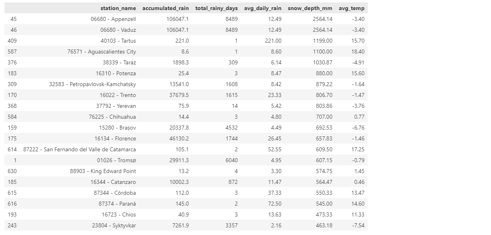

I look at these cases in more detail and I effectively find that this data is wrong, so after a deep analysis I create a new dataframe with selected cities from different countries, taking only 2 cities from Russia, in very different regions, to include cities from many countries. 

Snowy Cities: Vaduz, Taraz (Kazakhstan), Tromsø, Sapporo (Japan), Petropavlovsk-Kamchatsky (Russia), Syktyvkar (Russia), Brașov (Romania), Mikkeli (Finland)

When I import this csv file into Power BI, I do a quick analysis of the years registered with a line chart, with the year and the sum(snow_depth_mm), and I find that Vaduz has clearly wrong data, since the sum(snow_depth_mm) is way higher than the rest, so I decide to exclude this city from the dataframe.

Most cities have snow data from 1973, so I apply this filter, but then I find that Petropavlovsk-Kamchatsky (Russia) has only data from 1997, so I exclude it.

I also find that Taraz has a weird peak in 1994 and has snow data only until 1998, so I exclude it as well.

Sapporo has no data from 2003 to 2013.

Mikkeli has only data from 1982 to 2006, so this will be the constraint.

In the end I am left with Tromsø, Syktyvkar (Russia), Brașov (Romania) and Mikkeli (Finland).

# Conclusions

In the end we have studied mostly the rainfall and temperature. 

Comparing the accumulated rainfall and the number of rainy days gave us an interesting relationship and details about rain behaviour in different places. 

Regarding temperature, we studied the relationship between the avg, the max and min temperatures, seeing also that many places, although having the same average temperature, are very seasonal and are very extreme in winter and summer.

